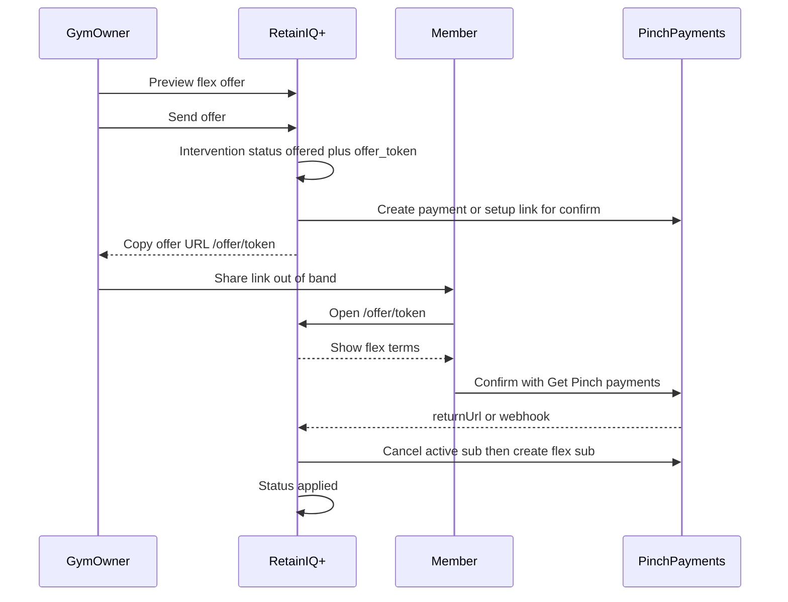
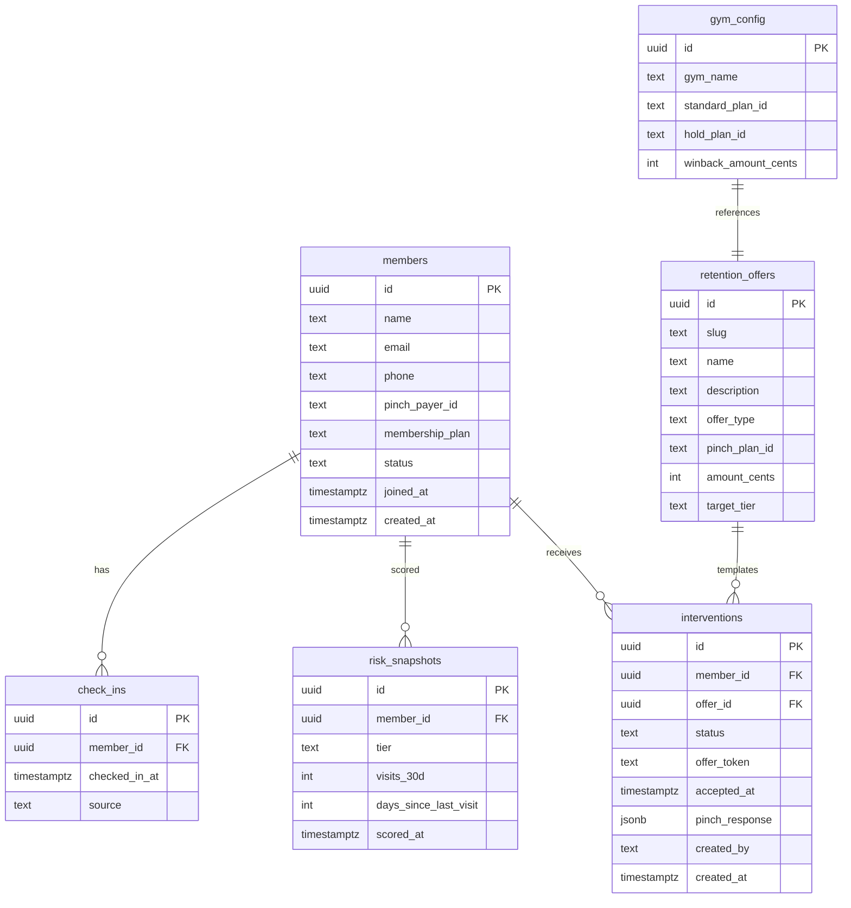
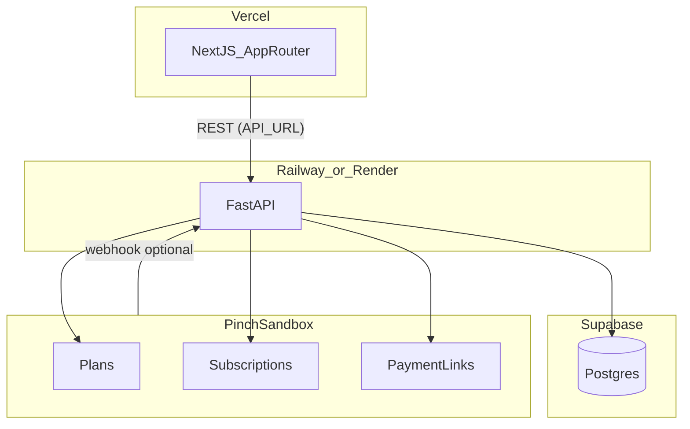

# RetainIQ+ — Product Requirements (Hackathon MVP)

> **Product name:** RetainIQ+ (configurable — update branding constants in `apps/web` without schema changes)
>
> **Build window:** 24 hours
>
> **Status:** Source of truth for hackathon implementation
>
> **Last reviewed:** 2026-07-25 — Send offer → `/offer/[token]` → Pinch confirm implemented; sandbox E2E next

---

## 0. Implementation Status

Snapshot of what is built vs what remains for demo-ready MVP.

> **Send/accept flow shipped:** Owner **Send offer** → status `offered` + `/offer/[token]` → member **Confirm with Pinch** → `POST /offers/{token}/complete` plan-switches → `applied`. Demo mode (empty `PINCH_API_KEY`) skips live Pinch and completes via return URL.

### 0.1 Backend — implemented

| Area | Path | Status | Notes |
|---|---|---|---|
| Rule-based risk tiers | `apps/api/app/services/scorer.py` | ✅ Done | Critical / Slipping / Healthy / Watch / Unknown |
| Regression insights | `apps/api/app/services/regression.py` | ✅ Done | Churn %, engagement, LTV, risk factors (§6.5) |
| Value projection | `apps/api/app/services/value_projection.py` | ✅ Done | 12-mo flex vs quit; `projection_for_offer()` helper |
| Member list + detail | `apps/api/app/routers/members.py` | ✅ Done | `GET /members/{id}` returns `insights` + `value_projection` |
| Force rescore | `POST /members/{id}/score` | ✅ Done | Writes `risk_snapshots` |
| Intervention preview + send | `apps/api/app/routers/interventions.py` | ✅ Done | Send → `offered` + token; no immediate plan switch |
| Public offer API | `GET/POST /offers/{token}` | ✅ Done | Member-safe GET; complete runs plan switch |
| Schema: `offered` + `offer_token` | `002_offer_token.sql` | ✅ Done | Applied remotely |
| Interventions log | `GET /interventions` | ✅ Done | Includes `offer_url`, `offered` status |
| Pinch client | `apps/api/app/services/pinch_client.py` | ✅ Done | Sandbox HTTP wrapper |
| Webhooks (optional) | `apps/api/app/routers/webhooks.py` | ✅ Done | Signature verify stub |
| Regression smoke | `apps/api/scripts/smoke_regression.py` | ✅ Done | Calibrated tier bands; run with `python -m scripts.smoke_regression` |

### 0.2 Backend — remaining

| Item | Priority | Notes |
|---|---|---|
| Pinch sandbox setup | **P0** | API key, plans, payers, seed IDs — see §12 |
| Live Pinch smoke tests | **P0** | Payment/setup link + post-confirm plan switch |
| Postgres / hosted DB | ⚠️ Partial | Supabase connected; keep seed Pinch IDs real for live demo |

### 0.3 Frontend — implemented

| Area | Status | Notes |
|---|---|---|
| Overview `/` | ✅ Wired | `GET /members` |
| Members list `/members` | ✅ Wired | Tier filter, search, sort |
| Member detail `/members/[id]` | ✅ Wired | API `insights` + `value_projection` (FR-017) |
| Send offer modal | ✅ Wired | Send → copy `/offer/...` link |
| Flex Plans `/actions` | ✅ Wired | Offered/Applied tabs + copy offer link |
| Member offer `/offer/[token]` | ✅ Wired | No owner chrome; Confirm with Pinch CTA |
| Offer complete `/offer/[token]/complete` | ✅ Wired | Calls complete API after Pinch return |
| API client | ✅ Done | Send + public offer helpers |
| `FlexPlanValueChart` | ✅ Wired | Detail, send modal, Flex Plans expand |

### 0.4 Frontend — FR-017 (done)

Member detail consumes API `insights` via `buildDetailViewModel()` in [`apps/web/src/lib/member-insights.ts`](apps/web/src/lib/member-insights.ts). Client heuristics (`buildMemberInsight`, fake social/support factors) removed.

| UI surface | Source |
|---|---|
| 60-Day Churn Probability + trend | `insights.churn_probability`, `insights.churn_trend_label` |
| Engagement Score / label | `insights.engagement_score`, `insights.engagement_label` |
| LTV Forecast / Risk Exposure | `insights.ltv_cents`, `insights.risk_exposure_cents` |
| Churn Risk Factors cards | `insights.risk_factors[]` |
| Cumulative value chart | `value_projection` on member detail |
| Send-modal value impact | `value_projection` from preview response |
| Flex Plans row expand | `FlexPlanValueChart` on expand |

**Checklist (FR-017):** ✅ All items complete.

### 0.5 What to do next (priority order)

| # | Task | Owner | Blocks |
|---|---|---|---|
| 1 | Pinch sandbox setup — key, Standard + Hold plans, 10 test payers (§12) | Backend / manual | Live Pinch confirm |
| 2 | Update seed with real `pinch_payer_id` values | Backend | Live send for demo members |
| 3 | E2E smoke — Sarah send → offer page → Pinch confirm → Flex Plans `applied` | QA | Definition of done |
| 4 | Demo rehearsal — 3-minute script (§17) | All | Hackathon ready |

See [status.md](status.md) for live tracker and changelog.

### 0.6 Route naming note

Requirements originally specified `/interventions` for the audit log. The shipped UI uses **`/actions`** (sidebar: “Actions”, page title: “Flex Plans”). The API path remains `GET /api/v1/interventions`. Member offer pages use **`/offer/[token]`** (no owner shell).

---

## 1. Product Overview

**Tagline:** Keep members at the gym with the right price — before they cancel.

**Vision:** RetainIQ+ helps gym owners identify members who are **expected to leave** and respond with **variable pricing offers** — delivered for the member to accept via Pinch Payments — that make staying more attractive than cancelling.

**MVP focus:** A rule-based churn scoring engine and gym-owner dashboard backed by seeded Supabase data. When a member is flagged as at risk, the system computes a **flex plan** (dynamic base + per-entry from a $30/week gym rate). The owner **previews and sends** the offer; the member opens a tokenized RetainIQ+ page, reviews terms, and **confirms with Pinch**. The gym cannot silently switch the plan. This is a **retention pricing product**, not a general engagement or loyalty platform.

---

## 2. Problem & Solution

### Problem

Traditional gyms force disengaged members into a binary choice: keep paying full price for a membership they barely use, or cancel entirely. Owners often only learn a member is unhappy when they submit a cancellation — too late to save lifetime value (LTV).

### Solution

RetainIQ+ sits between gym check-in data and Pinch Payments:

1. **Detect** members expected to leave using check-in frequency and recency.
2. **Surface** at-risk members on an owner dashboard with clear churn-risk tiers.
3. **Recommend** a per-member flex plan (base + per-entry, sized for casuals vs $30/week unlimited).
4. **Send** the flex offer to the member (tokenized link); the member reviews and **confirms via Pinch** before any plan switch.

The owner stays in control of *who* gets an offer and *what price* is proposed; the member completes setup on Pinch so billing changes are consented, not gym-applied unilaterally.

---

## 3. Goals & Non-Goals

### Goals (24h MVP)

| ID | Goal |
|---|---|
| G-001 | Score all members into risk tiers using rule-based check-in logic |
| G-002 | Display an owner dashboard with tier counts and filterable member list |
| G-003 | Show member detail with check-in history and suggested variable pricing offer |
| G-004 | Allow owner to preview and **send** a flex pricing offer (copyable `/offer/[token]` link) |
| G-005 | Log all interventions with status (`offered` / `applied` / `failed`) and Pinch response for demo audit trail |
| G-006 | Seed ~100 realistic members in Supabase for a compelling demo |
| G-007 | Show regression-based churn probability, LTV forecast, and flex-plan value projection on member detail and Flex Plans |
| G-008 | Let the member view the offer on `/offer/[token]` and complete Get Pinch payments confirmation before the flex plan is applied |

### Non-Goals (explicitly out of scope for 24h)

- Full ML platform (trained models, holdout evaluation, billing/class/PR features) — MVP uses calibrated logistic regression on check-ins (§6.5)
- LLM churn prediction
- Automated offer deployment without owner approval (no auto-send, auto-debits, or silent plan switches)
- Real gym CRM integrations (Mindbody, PushPress, Turnstile)
- SMS / WhatsApp / email delivery (owner copies the offer link manually if needed)
- Loyalty rewards or upsell offers for already-engaged members
- Accounting sync (Xero, MYOB, QuickBooks)
- Payment dishonor webhooks and failed-payment recovery flows
- Billing-event signals (MVP uses check-ins only)
- Multi-tenant auth (single demo gym)
- Full member self-serve portal (login, history, manage membership) — **tokenized offer page is in MVP**; broader portal is not
- Real-time cron scoring (on-demand scoring is sufficient)

---

## 4. Personas

### Primary: Gym Owner / Ops Manager (Alex)

- Runs a single boutique gym (~100 members).
- Wants a daily list of members expected to leave.
- Needs suggested **pricing offers**, not a black-box AI — must approve before an offer is sent.
- Uses retention pricing during save calls; shares the offer link with the member out of band.

### Secondary (MVP): Gym Member (e.g. Sarah Chen)

- Receives a RetainIQ+ offer link from the gym (text/email/in-person — delivery out of band).
- Needs to understand the flex terms (base + per visit, cap) before paying.
- Confirms the plan via **Get Pinch payments** hosted confirmation — not by the gym flipping the subscription for them.

### Future: Front-desk staff — not in MVP.

---

## 5. User Stories

| ID | Story | Acceptance Criteria |
|---|---|---|
| US-001 | As Alex, I want to see how many members are expected to leave vs. stable so I know where to focus retention pricing. | Overview shows tier counts; Critical + Slipping = "expected to leave". |
| US-002 | As Alex, I want to filter members by risk tier so I can focus on those needing attention. | Members table filters by tier; Critical members appear first by default. |
| US-003 | As Alex, I want to see a member's check-in history so I understand why they were flagged. | Detail page shows last 90 days of check-ins and computed metrics. |
| US-004 | As Alex, I want a suggested flex plan when a member is expected to leave so I don't have to invent discounts under pressure. | Critical + Slipping → flex (base + per entry) only when 12-month `improvement_cents > 0`; otherwise no recommended action. Healthy / Unknown → no pricing offer. |
| US-005 | As Alex, I want to preview a Pinch pricing offer before sending it so I know what the member will be charged. | Send modal shows base + per-entry + Pinch calculated-payments for the base plan. |
| US-006 | As Alex, I want to send a pricing offer with one click so I can share it during a retention call. | Confirm creates intervention `offered` with `/offer/[token]` link; **no** plan switch yet. |
| US-007 | As Alex, I want an interventions log so I can show judges what actions were taken. | Log lists member, offer type, status (`offered` / `applied` / `failed`), timestamp. |
| US-008 | As Alex, I want Pinch API failures handled gracefully so I don't think an offer was sent when it wasn't. | Failed Pinch calls set intervention status `failed` and show error message. |
| US-009 | As Alex, I want to see churn probability and projected LTV backed by check-in trends so retention calls are data-driven. | Member detail shows regression-based `churn_probability`, `ltv_cents`, and `risk_exposure_cents` from API. |
| US-010 | As Alex, I want to compare full-price vs flex-plan expected value before sending an offer. | Suggested offer card or preview modal shows 12-month `value_projection` chart. |
| US-011 | As Alex, I want to see whether a member has accepted so I know when the flex plan is live. | Flex Plans / member detail show `offered` until Pinch confirm completes, then `applied`. |
| US-012 | As a member, I want to open my offer link and see the flex terms so I understand the new price. | `/offer/[token]` shows base + per-entry, max cap, and short rationale; no owner dashboard chrome. |
| US-013 | As a member, I want to confirm the offer with Pinch so billing changes only happen with my consent. | CTA opens Get Pinch payments confirmation; on success intervention becomes `applied` and flex plan is switched. |
| US-014 | As a member, I want a clear success state after Pinch so I know setup worked. | Return URL `/offer/[token]/complete` (or equivalent) shows confirmation; owner log reflects `applied`. |

---

## 6. Risk Scoring Specification

### Input signals (MVP)

| Signal | Source | Description |
|---|---|---|
| `visits_30d` | `check_ins` table | Count of check-ins in rolling 30-day window |
| `days_since_last_visit` | `check_ins` table | Days between now and most recent check-in (null if never) |

No billing, class booking, or PR data in MVP.

### Risk tiers

Evaluation order matters — first matching rule wins (most severe first):

| Tier | Rule | Owner label | Suggested pricing offer |
|---|---|---|---|
| **Critical** | `days_since_last_visit >= 21` | Expected to leave | Flex plan (dynamic base + per entry) |
| **Slipping** | `days_since_last_visit >= 14` | Likely to leave | Flex plan (dynamic base + per entry) |
| **Healthy** | `visits_30d >= 8` | Low churn risk | No pricing offer — member not expected to leave |
| **Unknown** | Member joined < 30 days ago OR zero check-ins ever | Insufficient data | No offer; show "monitor" badge |

Members who don't match Critical or Slipping but also don't meet Healthy (e.g. 5 visits in 30d, last visit 10 days ago) are labeled **At Risk (watch)** — displayed between Slipping and Healthy in the UI, no pricing offer until severity increases.

**Product rule:** Variable pricing offers are only suggested for members **expected to leave** (Critical and Slipping tiers). Healthy members are tracked for context but are not retention-pricing targets.

### Scoring trigger

- Computed on-demand when `GET /members` or `GET /members/{id}` is called.
- Optional cache write to `risk_snapshots` for demo performance.
- `POST /members/{id}/score` forces recompute and returns fresh tier.

### Edge cases

| Case | Behavior |
|---|---|
| New member (< 30 days since `joined_at`) | Tier = `unknown`; exclude from Critical/Slipping counts on overview |
| Never checked in | `days_since_last_visit` = days since `joined_at`; tier = `unknown` if < 30 days, else Critical if >= 21 |
| No `pinch_payer_id` | Show member in dashboard; block Send with message "Pinch payer not linked" |
| Duplicate check-ins same day | Count each row (or dedupe by date — implement dedupe by calendar day in scorer) |

### Regression-based churn probability (§6.5)

Rule tiers (above) remain the **primary** driver for offer eligibility and dashboard sorting. Add a lightweight **regression layer** so the member detail KPIs (“60-Day Churn Probability”, engagement trend) are statistically grounded instead of client-side heuristics.

**Goal:** Estimate `P(churn within 60 days)` and visit-trend direction from check-in history.

**Features (computed per member from `check_ins`):**

| Feature | Definition |
|---|---|
| `visits_30d` | Distinct check-in days in last 30 days (same as tier input) |
| `days_since_last_visit` | Same as tier input |
| `visit_slope_90d` | Slope of weekly visit counts over last 12 weeks (linear regression on week index → visit count) |
| `visit_accel` | Difference between mean visits in weeks 1–4 vs weeks 5–8 (recent vs prior month) |
| `tenure_days` | Days since `joined_at` |

**Model (MVP — not full ML platform):**

1. Build weekly buckets for the last 12 weeks (distinct days per week).
2. Fit **simple linear regression**: `weekly_visits ~ week_index` → `visit_slope_90d`.
3. Compute **logistic score** (fixed coefficients tuned on seed cohort, stored in code):

   ```
   logit = β0 + β1·days_since_last_visit + β2·(8 - visits_30d) + β3·(-visit_slope_90d) + β4·max(0, 30 - tenure_days)
   P_churn_60d = sigmoid(logit)   // clamp to [0.05, 0.95], display as 0–100%
   ```

4. Calibrate β so tier medians align with UI expectations: Critical ≈ 75–92%, Slipping ≈ 45–68%, Healthy ≈ 8–18%.

**Trend label (`churn_trend_label`):**

- Compare `visits_30d` (or last-14d count) to prior 14-day window from check-ins.
- Emit strings like `+12% vs last week` (Critical/Slipping) or `Stabilized` (Healthy).

**Engagement score:**

- `engagement_score = round(100 × percentile_rank(visits_30d, all_active_members))`
- Labels: Bottom 5% / Bottom quartile / Near cohort average / Top 20% (same thresholds as current UI).

**Risk factors (server-generated, no fake hash data):**

| Factor key | Source | Severity driver |
|---|---|---|
| `attendance` | `days_since_last_visit`, `visits_30d`, `visit_slope_90d` | Same logic as current UI attendance card |
| `payment` | `pinch_payer_id` present | Blocked if missing |
| `momentum` | `visit_slope_90d`, `visit_accel` | Negative slope → higher severity |
| `tenure` | `tenure_days` | New members (< 30d) → neutral / monitor |

**Implementation:** `apps/api/app/services/regression.py` (or extend `scorer.py`). Dependencies: `numpy` or pure Python for 12-point slope; no sklearn requirement unless already in stack.

**Non-goal boundary:** This is a **calibrated logistic score + linear trend**, not a trained ML pipeline with holdout sets. Full multivariate ML remains post-hackathon (§19).

---

## 7. Variable Pricing Offer Catalog

All offers are **flex plans** — base + per-entry pricing for casuals who are expected to leave. Template lives in `retention_offers` as `hold_plan`; **base and per-entry are computed per member** (§7.4). Delivery uses a **tokenized member offer page** plus Pinch payments confirmation; the flex plan switch runs only **after** member confirm. No one-off win-back as the suggested offer (`winback_link` seed row unused).

| Offer ID | Name (UI) | Target tier | Pinch mechanism | Amount | Purpose |
|---|---|---|---|---|---|
| `hold_plan` | Flex Plan | Critical + Slipping | Send offer link → member confirms on Pinch → then cancel/recreate on Hold/Flex (base fee) | Dynamic base + per entry (§7.4) | Casual-priced retention vs $30/week unlimited |

### Per-member flex pricing engine (§7.4)

**Implementation:** `apps/api/app/services/pricing.py`

Reference: gym unlimited ≈ **$30/week**. All flex amounts are **weekly** (not monthly flats). Flex is cheaper below a break-even visit count (casuals); a **weekly max cap** (≥ $30) prevents power users from beating unlimited.

```
WEEKLY_CENTS = 3000   // also the minimum max-cap

P = churn_probability_pct / 100
base_weekly = clamp(round_dollars(WEEKLY × (0.55 - 0.25×P)), $10, $20)
break_even_visits_per_week = clamp(round(4 - 1.5×P), 2, 4)
per_entry = clamp(round_dollars((WEEKLY - base_weekly) / break_even), $2, $8)

// Max cap never below unlimited $30/week
max_cap_weekly = max(WEEKLY, round_dollars(WEEKLY × (1.15 + 0.20×(1-P))))

expected_visits_per_week = clamp(round(visits_30d/4) or default, 1, break_even - 1)
estimated_weekly = min(base_weekly + expected_visits × per_entry, max_cap_weekly)

// Quit timing from P_churn_60d via exponential survival (not 24×(1−P))
expected_quit_months = clamp(60 / -ln(1 − P) / 30, 1, 12)
expected_flex_months = clamp(quit + (12 − quit) × 0.45, quit + 1, 12)
```

Example: `$15/wk + $3/visit`, max cap `$40/wk` (cap must be ≥ `$30/wk`). Example tenure: **69% → ~2 mo** quit (was incorrectly ~7 mo under the old lifetime-share heuristic).

API `pricing_breakdown` (weekly primary):

```json
{
  "amount_cents": 1800,
  "amount_kind": "base_plus_entry",
  "base_weekly_cents": 1500,
  "per_entry_cents": 300,
  "max_cap_weekly_cents": 4000,
  "expected_visits_per_week": 1,
  "estimated_weekly_cents": 1800,
  "break_even_visits": 5,
  "weekly_rate_cents": 3000
}
```

**Pinch economics:** Weekly base × 4 (monthly approx) for sandbox plan amounts; persist full `pricing_breakdown`. Per-entry + cap are RetainIQ+ economics (not metered live in Pinch for MVP).

### Send + accept flow (plan-based flex)

The gym **cannot** directly apply the flex plan. Flow:



**Owner send (creates `offered`):**

1. `GET /plans/{planId}/calculated-payments` — preview base schedule (`totalAmount` = recommended base when supported)
2. Owner confirms **Send offer** (not Apply)
3. Create intervention with status `offered`, unique `offer_token`, and `pricing_breakdown` in `pinch_response`
4. Create Pinch payment/setup link for member confirmation (`returnUrl` → `/offer/{token}/complete`)
5. Return copyable RetainIQ+ URL: `/offer/{token}` (plus Pinch URL for the Confirm CTA)

**Member accept (promotes to `applied`):**

6. Member opens `/offer/{token}` — sees flex terms (base + per-entry, max cap)
7. Member clicks **Confirm with Pinch** → Get Pinch payments confirmation
8. On success (`returnUrl` and/or webhook): Pinch has no “move plan” — **cancel + recreate**:
   - `GET /subscriptions/payer/{payerId}` — find active subscription
   - `DELETE /subscriptions/{subscriptionId}` — cancel current
   - `POST /subscriptions` — create on flex/hold plan
9. Update intervention to `applied`; set `members.membership_plan = 'flex'`; store Pinch subscription id

**Failure:** Any Pinch error on send or accept → status `failed` with error in `pinch_response`.

### Expected value & LTV projection (§7.5)

**Implementation:** `apps/api/app/services/value_projection.py`

| Path | Assumption |
|---|---|
| **Current (unlimited)** | Member pays `MONTHLY_FULL` ($30/week × 52/12) for `months_to_quit`, then $0 |
| **Flex** | Weekly bill `min(base + visits×entry, max_cap)` rolled to monthly for `flex_retention_months`, then $0 |

`months_to_quit` / LTV tenure are derived from `P_churn_60d` with exponential survival (`E[days] = 60 / -ln(1−P)`), clamped to the 12-month offer horizon — so the 60-day churn KPI and “leave in X mo” stay coherent.

**API payloads:** Return `value_projection` + `pricing_breakdown` wherever an offer is suggested or previewed. UI shows `$X/wk + $Y/visit`, max cap, expected visits/wk.

---

## 8. Functional Requirements

| ID | Requirement |
|---|---|
| FR-001 | System shall store members and check-ins in Supabase Postgres |
| FR-002 | System shall compute risk tier per member using rules in Section 6 |
| FR-003 | Dashboard shall display tier summary counts (excluding `unknown`) |
| FR-004 | Dashboard shall list members with tier badge, visits_30d, days_since_last_visit |
| FR-005 | Dashboard shall default-sort by severity: Critical → Slipping → watch → Healthy |
| FR-006 | Member detail shall show check-in timeline for last 90 days |
| FR-007 | Member detail shall display one primary suggested pricing offer when tier is Critical or Slipping; otherwise show "No pricing offer — member not at churn risk" |
| FR-008 | Send offer shall require owner confirmation after Pinch preview; owner confirm **sends** the offer (status `offered`) and does **not** plan-switch |
| FR-009 | System shall persist every intervention attempt with status: `suggested`, `offered`, `applied`, `failed` (schema today only allows suggested/applied/failed — migration required) |
| FR-010 | Pinch API credentials shall only be used server-side in FastAPI |
| FR-011 | System shall support single demo gym without multi-tenant isolation |
| FR-012 | Optional: `POST /webhooks/pinch` shall verify `pinch-signature` and update member on `subscription-cancelled`; may also complete offered → applied on payment/subscription success events when available |
| FR-013 | `GET /members/{id}` shall return `insights` block: churn probability, engagement score, LTV, risk exposure, risk factors, visit regression slope (§6.5) | ✅ Done |
| FR-014 | `GET /members/{id}` shall return `value_projection` when a suggested offer exists (§7.5) | ✅ Done |
| FR-015 | `POST /members/{id}/interventions/preview` shall return `value_projection` alongside Pinch preview | ✅ Done |
| FR-016 | Flex Plans page shall aggregate `improvement_cents` from applied interventions (frontend already sums; backend must persist accurate projections) | ✅ Done |
| FR-017 | Frontend shall remove client-side `buildMemberInsight()` heuristics once FR-013–FR-014 are live; keep only presentational helpers (chart bucketing, member code formatting) | ✅ Done |
| FR-018 | System shall compute per-member flex base + per-entry via §7.4 ($30/week anchor); return `pricing_breakdown` on member detail, preview, and interventions list |
| FR-019 | UI shall display `$X/wk + $Y/visit`, weekly max cap (≥ $30/wk), expected visits/wk, and break-even |
| FR-020 | Suggested offers for Critical and Slipping shall both use flex (`hold_plan`); Pinch payment/setup link is the **member confirmation** delivery mechanism; economics remain base + per-entry (not a one-off win-back product) |
| FR-021 | `POST /members/{id}/interventions` (send) shall create a unique `offer_token`, status `offered`, and return `offer_url` (`/offer/{token}`) plus Pinch confirm URL |
| FR-022 | Public `GET /offers/{token}` shall return member-safe offer payload (name, flex terms, pricing_breakdown, Pinch confirm URL); no owner secrets or full gym roster |
| FR-023 | Member confirmation (return URL handler and/or webhook) shall run cancel+recreate plan switch and set status `applied` only after Pinch success |
| FR-024 | Frontend shall provide `/offer/[token]` (no owner sidebar) with flex terms and **Confirm with Pinch** CTA, plus a post-return complete state |

---

## 9. Non-Functional Requirements

| ID | Requirement |
|---|---|
| NFR-001 | Dashboard initial load < 3s on seeded data (~100 members) |
| NFR-002 | Pinch secrets never exposed to browser (no `NEXT_PUBLIC_PINCH_*`) |
| NFR-003 | Demo must work offline from gym CRM (all data seeded in Supabase) |
| NFR-004 | Idempotent offer send — disable Send while in-flight; reject duplicate active `offered`/`applied` for same member+offer; offer tokens unguessable |
| NFR-005 | CORS: FastAPI allows requests from Vercel frontend origin only |
| NFR-006 | All monetary values stored in cents (integer) in DB; displayed as AUD |

---

## 10. Data Model

### Entity relationship



### Table definitions

See [`supabase/migrations/001_initial_schema.sql`](supabase/migrations/001_initial_schema.sql) for DDL.

**Required schema evolution (not yet migrated):**

| Change | Detail |
|---|---|
| `interventions.status` | Extend CHECK to include `offered` (`suggested`, `offered`, `applied`, `failed`) |
| `interventions.offer_token` | Unique, nullable text — set on send; used by `/offer/[token]` |
| `interventions.accepted_at` | Nullable timestamptz — set when member Pinch confirm completes |
| `pinch_response` JSON | May include `offer_url`, `payment_link_url`, `pricing_breakdown`, subscription ids |

---

## 11. Integrations

### Supabase (Postgres)

- Hosted Supabase project for DB.
- FastAPI connects via `DATABASE_URL` (service role or direct Postgres connection).
- Next.js does **not** connect to Supabase directly in MVP — all data via FastAPI.

### Pinch Payments (sandbox)

| Operation | Endpoint | Used when |
|---|---|---|
| Preview schedule | `GET /plans/{planId}/calculated-payments` | Owner send-modal preview |
| Create payment link | `POST /payment-links` | Member Confirm with Pinch (delivery of confirmation) |
| List payer subscriptions | `GET /subscriptions/payer/{payerId}` | After member confirm, before plan switch |
| Cancel subscription | `DELETE /subscriptions/{id}` | Post-confirm flex plan switch |
| Create subscription | `POST /subscriptions` | Post-confirm flex plan switch |
| Webhook (optional) | `POST /webhooks/pinch` | `subscription-cancelled`; optionally payment/subscription success to flip `offered` → `applied` |

**Documentation:** [docs.getpinch.com.au](https://docs.getpinch.com.au)

**Webhook verification:** HMAC-SHA256 of `{timestamp}.{body}` against webhook secret (`whsec_...`); reject if timestamp > 5 minutes old.

**Product rule:** Payment/setup links are for **member confirmation**, not a substitute for flex (base + per-entry) pricing. Plan switch runs only after the member completes Get Pinch payments confirmation.

---

## 12. Pre-Demo Pinch Sandbox Setup

Complete **before** integration coding (Phase 3). Store resulting IDs in Supabase `gym_config` and `retention_offers`.

### Step 1: Confirm sandbox credentials

- Obtain test API key from Pinch Developer Portal.
- Set `PINCH_API_KEY` and `PINCH_BASE_URL` (test mode) in FastAPI env.
- Confirm test/live mode matches seeded payer records.

### Step 2: Create Plans in Pinch portal or via API

Create three versioned plans (plans cannot be edited once they have subscribers):

| Plan name | Purpose | Suggested config |
|---|---|---|
| `RetainIQ+ Standard v1` | Default membership (seed data reference) | e.g. $89/mo recurring |
| `RetainIQ+ Hold v1` | Critical tier — retention hold pricing | $10/mo recurring |

```bash
# Example: create Hold plan via API (adjust amounts to your sandbox)
curl -X POST "$PINCH_BASE_URL/plans" \
  -H "Authorization: Bearer $PINCH_API_KEY" \
  -H "Content-Type: application/json" \
  -d '{
    "name": "RetainIQ+ Hold v1",
    "currency": "AUD",
    "recurringPayment": { "amount": 1000, "frequency": "monthly" }
  }'
```

Record each returned `id` as `hold_plan_id`, `standard_plan_id` in `gym_config`.

### Step 3: Create test Payers and Subscriptions

For demo members who will receive flex offers:

1. Create payers in Pinch sandbox (or use existing test payers).
2. Create active subscriptions on Standard plan.
3. Copy `payerId` values into `members.pinch_payer_id` in seed data.

At minimum, seed **5 Critical** and **5 Slipping** members with valid `pinch_payer_id` and active subscriptions for live demo send → confirm.

### Step 4: Member confirm checkout (CaptureJS)

- Flex confirmation uses **RetainIQ+ `/offer/{token}/confirm`**, not Pinch hosted Payment Links (Payment Links show **N/A** for due date and a single flat amount — not suitable for flex range UX).
- Set `PINCH_PUBLISHABLE_KEY` (Pinch Developer Portal → API Keys) alongside `PINCH_MERCHANT_ID` / `PINCH_API_KEY`.
- Member flow: open `/offer/{token}` → **Confirm payment method** → `/offer/{token}/confirm` (CaptureJS tokenizes card/BSB) → `POST /offers/{token}/vault-source` → `POST /offers/{token}/complete` (cancel + recreate subscription).
- Owner shares RetainIQ+ `/offer/{token}` only (never the raw `pay.getpinch.com.au` URL).
- Payment Links (`POST /payment-links`) remain optional for smoke tests / owner Pinch preview only; stored in `pinch_response` but not returned on public `GET /offers/{token}`.

### Step 5: Optional webhook

1. Create webhook in Pinch portal pointing to `{API_URL}/webhooks/pinch`.
2. Subscribe to `subscription-cancelled` (and payment/subscription success events if used to complete offers).
3. Store `whsec_...` secret as `PINCH_WEBHOOK_SECRET`.

### Step 6: Verify with smoke tests

| Test | Expected |
|---|---|
| List subscriptions for demo payer | Returns active Standard subscription |
| Calculated payments for Hold plan | Shows flex base schedule |
| CaptureJS vault on `/offer/{token}/confirm` | Tokenizes card/BSB; `POST /offers/{token}/vault-source` saves source |
| Member confirm → cancel + recreate | New subscription on Hold/Flex; intervention `applied` |
| Create payment link (optional smoke) | Returns hosted Pinch URL — **not used for member UX** (shows N/A + flat amount) |

---

## 13. System Architecture



### Deployment

| Component | Host | Notes |
|---|---|---|
| Frontend | **Vercel** | Next.js 15 App Router |
| Backend | **Railway or Render** (recommended) | FastAPI + uvicorn; avoids Vercel Python cold-start friction |
| Database | **Supabase** | Managed Postgres |

Alternative: FastAPI on Vercel Python serverless — possible but not recommended for 24h hackathon.

### Environment variables

**`apps/web` (Vercel)**

| Variable | Description |
|---|---|
| `NEXT_PUBLIC_API_URL` | FastAPI base URL |

**`apps/api` (Railway/Render)**

| Variable | Description |
|---|---|
| `DATABASE_URL` | Supabase Postgres connection string |
| `PINCH_API_KEY` | Pinch sandbox API key |
| `PINCH_BASE_URL` | e.g. `https://api.getpinch.com.au/test` |
| `PINCH_WEBHOOK_SECRET` | Webhook signing secret (optional) |
| `CORS_ORIGINS` | Comma-separated frontend URLs |
| `DEMO_GYM_NAME` | Display name, default `RetainIQ+ Demo Gym` |

---

## 14. API Contract (FastAPI)

Base path: `/api/v1`

### `GET /members`

Query params: `risk_tier` (optional), `sort` (`severity` | `name` | `last_visit`, default `severity`)

**Note:** Summary includes `watch` tier (implemented in scorer; frontend displays it).

```json
{
  "summary": { "healthy": 60, "slipping": 25, "critical": 15, "watch": 8, "unknown": 5 },
  "members": [
    {
      "id": "uuid",
      "name": "Sarah Chen",
      "email": "sarah@example.com",
      "risk_tier": "critical",
      "visits_30d": 0,
      "days_since_last_visit": 24,
      "membership_plan": "standard",
      "pinch_payer_id": "payer_xxx"
    }
  ]
}
```

### `GET /members/{id}`

**Implemented:** `insights` (regression + LTV) and `value_projection` (when offer exists). Frontend consumes these via FR-017.

```json
{
  "member": { "id": "uuid", "name": "Sarah Chen", "...": "..." },
  "risk": { "tier": "critical", "visits_30d": 0, "days_since_last_visit": 24 },
  "check_ins": [{ "checked_in_at": "2026-06-01T08:30:00Z" }],
  "suggested_offer": {
    "slug": "hold_plan",
    "name": "Hold / Pause",
    "description": "Reduce monthly fee while member pauses",
    "offer_type": "plan_switch",
    "amount_cents": 1900
  },
  "pricing_breakdown": {
    "amount_cents": 1800,
    "amount_kind": "base_plus_entry",
    "months_to_quit": 1,
    "flex_retention_months": 6,
    "current_monthly_cents": 13000,
    "formula": "weekly: min(base + visits × per_entry, max_cap); quit = 60/-ln(1-P)/30",
    "explanation": "Expected to leave in 1 month; flex keeps them ~6 months.",
    "inputs": {
      "churn_probability_pct": 84,
      "membership_plan": "standard",
      "offer_slug": "hold_plan"
    }
  },
  "insights": {
    "churn_probability": 84,
    "churn_trend_label": "+18% vs last week",
    "engagement_score": 0,
    "engagement_label": "Bottom 5%",
    "ltv_cents": 13000,
    "risk_exposure_cents": 299000,
    "visit_slope_90d": -0.42,
    "risk_factors": [
      {
        "key": "attendance",
        "title": "Attendance Drop",
        "level": "critical",
        "label": "Critical",
        "description": "24 days inactive — engagement collapsed this month.",
        "severity": 92
      }
    ]
  },
  "value_projection": {
    "horizon_months": 12,
    "current_plan_monthly_cents": 6900,
    "current_total_cents": 27600,
    "flex_total_cents": 22800,
    "improvement_cents": -4800,
    "flex_plan_label": "Hold @ $19/mo",
    "full_price_months": 4,
    "flex_retention_months": 12,
    "series": []
  }
}
```

### `POST /members/{id}/interventions/preview`

Request: `{ "offer_slug": "hold_plan" }`

Response includes Pinch preview **and** `value_projection` (§7.5).

### `POST /members/{id}/score`

Force recompute. Returns `{ "tier": "critical", "visits_30d": 0, "days_since_last_visit": 24 }`.

### `POST /members/{id}/interventions` (send offer)

Request:

```json
{
  "offer_slug": "hold_plan",
  "confirmed": true
}
```

Response (success — offer sent, awaiting member):

```json
{
  "intervention_id": "uuid",
  "status": "offered",
  "offer_token": "tok_xxx",
  "offer_url": "http://localhost:3000/offer/tok_xxx",
  "payment_link_url": "https://pay.getpinch.com.au/...",
  "preview": { "next_payment_amount_cents": 1000, "next_payment_date": "2026-08-01" },
  "pricing_breakdown": {},
  "value_projection": {}
}
```

**Note:** Current code returns `status: "applied"` and plan-switches immediately — that behavior is incorrect relative to this spec and must be replaced.

### `GET /offers/{token}` (public, member-safe)

Returns offer details for `/offer/[token]` (no auth). Include: member first name (or display name), offer name, `pricing_breakdown`, `flex_weekly_range_label`, `capture_publishable_key`, `demo_mode`, short description, status. **Exclude** `payment_link_url` (Pinch hosted links show N/A + flat amount). Exclude owner analytics, full insights, and secrets.

### `POST /offers/{token}/vault-source` (public, member-safe)

Accepts CaptureJS token + `source_type` (`credit-card` | `bank-account`). Vaults payment source on the member's Pinch payer via `POST /payers/{payerId}/sources`. Called from `/offer/{token}/confirm` before complete.

### `POST /offers/{token}/complete` (or return-URL handler)

Called after member confirms on `/offer/{token}/confirm`. Runs cancel+recreate plan switch if still `offered`; sets `applied` + `accepted_at`. Idempotent if already `applied`.

### `GET /interventions`

Used by frontend **Flex Plans** page (`/actions`). **Implemented** with extended fields; must surface `offered` and `offer_url`:

```json
{
  "interventions": [
    {
      "id": "uuid",
      "member_id": "uuid",
      "member_name": "Sarah Chen",
      "offer_slug": "hold_plan",
      "offer_name": "Hold / Pause",
      "status": "offered",
      "created_at": "2026-07-25T05:00:00Z",
      "risk_tier": "critical",
      "offer_url": "http://localhost:3000/offer/tok_xxx",
      "payment_link_url": "https://pay.getpinch.com.au/...",
      "pinch_subscription_id": null,
      "error_message": null,
      "value_projection": {
        "current_total_cents": 8900,
        "flex_total_cents": 12000,
        "improvement_cents": 3100,
        "series": []
      }
    }
  ]
}
```

### `POST /webhooks/pinch` (optional)

- Verify signature
- On `subscription-cancelled`: update member status, insert risk note
- On payment/subscription success (when configured): complete matching `offered` intervention → `applied` + plan switch if not already done via return URL
- Return `200 OK`

---

## 15. UI Specification

### Screens

| Route | Screen | Key components |
|---|---|---|
| `/` | Overview | Tier stat cards, "Needs attention" table (Critical + Slipping) |
| `/members` | Members list | Data table with tier filter, sort, search by name |
| `/members/[id]` | Member detail | Metrics row, check-in chart/list, suggested pricing offer card (Critical/Slipping only), **Send offer** button |
| `/actions` | Flex Plans (interventions log) | Chronological list with status badges (`offered` / `applied` / `failed`), value summary, expandable chart, copy offer link when `offered` |
| `/offer/[token]` | Member offer (no owner chrome) | Brand, flex terms (base + per-entry + cap), **Confirm with Pinch** CTA |
| `/offer/[token]/complete` | Member success | Confirmation that flex setup completed via Pinch |

### Send offer modal (owner)

1. Offer name + description (variable pricing rationale)
2. Pinch preview (amount + next payment date) + value projection
3. Cancel / **Send offer** buttons
4. Loading state during Pinch / send calls
5. Success: “Offer sent — share this link” + copyable `/offer/{token}` (and optional Pinch URL)
6. Error: show Pinch error message; intervention marked failed

### Member offer page

1. RetainIQ+ + gym name (no sidebar, no owner nav)
2. Personalized headline (e.g. “A flex plan from RetainIQ+ Demo Gym”)
3. Flex summary: `$X/wk + $Y/visit`, max cap, short plain-language why
4. Primary CTA: **Confirm with Pinch** → Pinch hosted confirmation
5. After return: success copy; if token invalid/expired/already applied, clear empty/error state

### Design notes

- Use shadcn/ui + Tailwind for speed
- Tier colors: Healthy = green, Slipping = amber, Critical = red, Unknown = gray
- Intervention status: `offered` = amber, `applied` = green, `failed` = red
- Mobile-responsive table (horizontal scroll acceptable for demo); member offer page must work on mobile

---

## 16. Seed Data Specification

| Parameter | Value |
|---|---|
| Gym name | RetainIQ+ Demo Gym |
| Member count | ~100 |
| Check-in history | 90 days |
| Tier distribution (target) | ~60 Healthy, ~25 Slipping, ~15 Critical, ~5 Unknown |
| Pinch-linked members | At least 10 (5 Critical, 5 Slipping) with real sandbox payer IDs |

### Seed member personas (for demo script)

| Name | Tier | Story |
|---|---|---|
| Sarah Chen | Critical | 24 days inactive; was Healthy 8+ visits/mo two months ago — primary **member accept** demo |
| Marcus Webb | Slipping | 16 days inactive; sporadic visitor — second send / offered state |
| Jamie Torres | Healthy | 12 visits in 30 days; low churn risk — no pricing offer needed |

See [`supabase/seed.sql`](supabase/seed.sql) for generated data.

---

## 17. Demo Script & Success Criteria

### 3-minute demo script

1. **Open dashboard** — "RetainIQ+ monitors 100 members. 15 are expected to leave today."
2. **Filter Critical** — show sorted list; click **Sarah Chen**.
3. **Member detail** — "Sarah hasn't checked in for 24 days. She was here 10 times in May — high churn risk."
4. **Suggested pricing offer** — show computed flex amount + quit/retention rationale (`pricing_breakdown`).
5. **Preview & Send** — show pricing rationale + Pinch preview → **Send offer** → copy `/offer/...` link; Flex Plans shows `offered`.
6. **Member perspective** — open offer link in a second tab (no owner chrome); show flex terms → **Confirm with Pinch** → complete sandbox confirmation → success page.
7. **Flex Plans log** — show Sarah as `applied` with value impact; optionally send Marcus and leave him `offered` to contrast.
8. **Optional contrast (Jamie Torres, Healthy)** — show member detail with no pricing offer; "Not expected to leave."

### Success criteria (definition of done)

- [ ] Dashboard loads seeded members with correct tier counts
- [ ] Member detail shows API-driven churn probability, LTV, and value projection (not client heuristics)
- [ ] Owner send creates `offered` intervention with copyable `/offer/[token]` (no immediate plan switch)
- [ ] Member offer page shows flex terms and Confirm with Pinch CTA
- [ ] At least one live Pinch confirmation + post-confirm plan switch succeeds in sandbox
- [ ] Interventions log reflects `offered` then `applied`
- [ ] No Pinch secrets in frontend bundle
- [ ] Demo script completable in under 3 minutes without manual DB edits

---

## 18. 24-Hour Build Phases

| Phase | Hours | Deliverable | Status |
|---|---|---|---|
| 1. Foundation | 0–4 | Supabase schema + seed, FastAPI scaffold, Next.js scaffold | ✅ Done |
| 2. Scoring | 4–8 | Rule engine + members API + dashboard list | ✅ Done |
| 2b. Analytics | 6–10 | Regression churn score + expected value on member detail (§6.5, §7.5) | ✅ Done |
| 3. Pinch | 8–14 | Pinch client, sandbox plans, send-offer + member confirm flow | ⚠️ Client done; send/accept + sandbox pending |
| 4. Polish | 14–20 | Wire frontend to API insights, `FlexPlanValueChart`, remove client heuristics (FR-017) | ✅ Done — send/accept E2E next |
| 5. Demo prep | 20–24 | Env vars, seed refresh, Pinch smoke tests, demo rehearsal | Pending |

---

## 19. Future Roadmap (post-hackathon)

Deferred to keep MVP focused on **retention pricing for at-risk members**:

- Full ML churn platform (trained models, holdout evaluation, billing/classes/PR features) — MVP uses calibrated logistic regression on check-ins only (§6.5)
- Auto-triggered Pinch pricing offers on tier change (with owner approval rules)
- Owner-editable custom amount builder (MVP computes amounts via §7.4; owners approve/send, do not edit)
- Dishonor webhook recovery with retention pricing
- Real gym CRM integrations (Mindbody, PushPress) for live check-in data
- Multi-tenant gym accounts with Supabase Auth
- Full member self-serve portal (login, history, manage membership) — MVP only has tokenized `/offer/[token]`
- Email/SMS delivery of offer links

Explicitly **not** on roadmap unless scope expands: loyalty rewards for engaged members, SMS/WhatsApp outreach agents, accounting sync.

---

## 20. Repository Structure

```
/
├── apps/
│   ├── web/                 # Next.js 15 + TypeScript — FR-017 insights + value charts wired
│   └── api/                 # FastAPI + scorer + regression + value_projection + Pinch client
├── supabase/
│   ├── migrations/
│   └── seed.sql
├── requirements.md          # This document
└── product.md               # Product vision (retention pricing focus)
```
